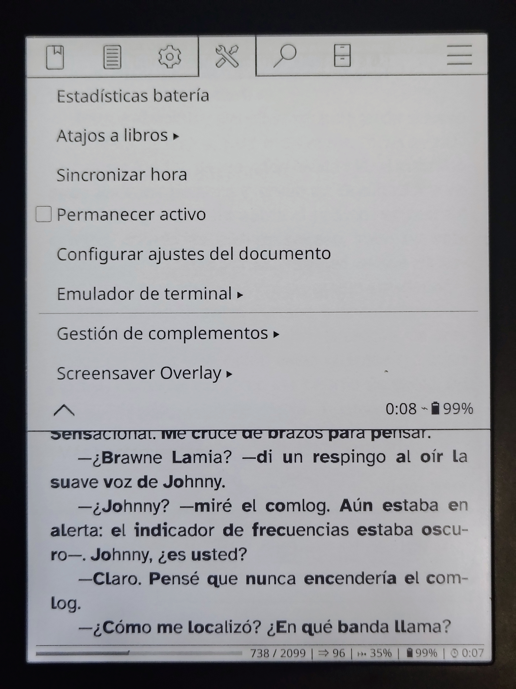
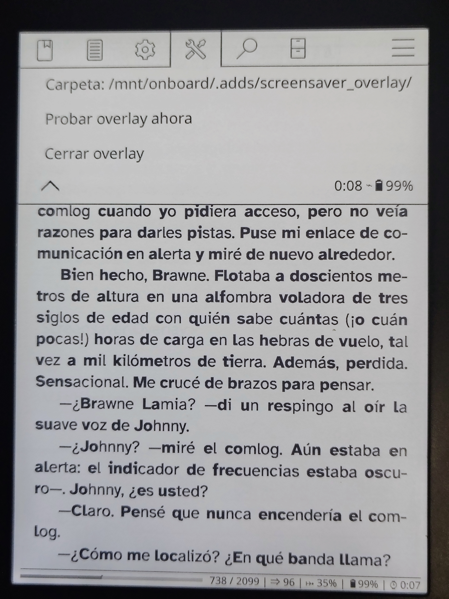
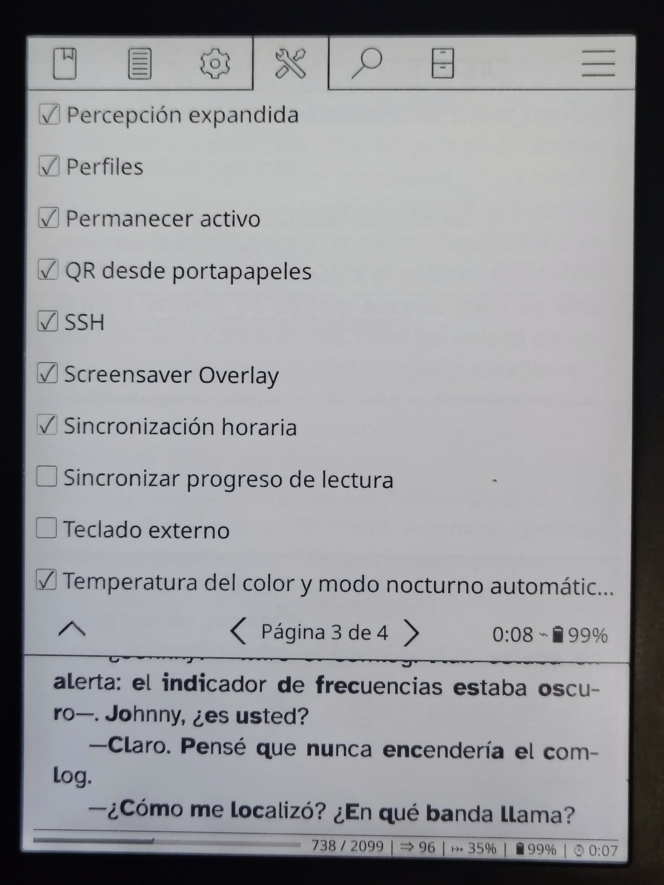

# ScreensaverOverlay - Plugin para KOReader

> [English version below](#screensaveroverlay---koreader-plugin)

Superpone una imagen PNG con transparencia sobre la página que estás leyendo al suspender el dispositivo. Donde la imagen es transparente, el texto del libro sigue visible debajo.

| Sin overlay | Con overlay |
|-------------|-------------|
|  |  |

---

## ¿Cómo funciona?

Al cerrar la tapa o suspender el dispositivo, el plugin toma una imagen aleatoria de tu carpeta y la muestra encima de la página actual. La imagen **solo cambia** si leíste algo desde el último bloqueo — si abres y cierras sin leer, mantiene la misma imagen.

### Ejemplos de overlays

| | | |
|---|---|---|
|  |  |  |
|  |  | |

---

## Requisitos

- KOReader v2024 o superior
- Kobo con KOReader instalado (probado en **Kobo Clara HD**)
- Imágenes PNG con canal alpha (transparencia)

---

## Instalación

### 1. Descarga el plugin

Ve a [Releases](../../releases) y descarga el archivo `.zip` más reciente.

### 2. Copia la carpeta al Kobo

Conecta el Kobo al PC y copia la carpeta `screensaver_overlay.koplugin` a:

```
KOBOeReader\.adds\koreader\plugins\
```

La estructura debe quedar así:

```
KOBOeReader\
  .adds\
    koreader\
      plugins\
        screensaver_overlay.koplugin\
          main.lua
          _meta.lua
```

### 3. Crea la carpeta de imágenes

Crea esta carpeta en tu Kobo:

```
KOBOeReader\.adds\screensaver_overlay\
```

Y pon dentro tus imágenes PNG con transparencia.

### 4. Reinicia KOReader

El plugin aparecerá en **Herramientas → Screensaver Overlay**.



---

## Uso

Ve a **Menú → Herramientas → Screensaver Overlay**:



| Opción | Descripción |
|--------|-------------|
| Carpeta | Muestra y permite cambiar la ruta de las imágenes |
| Probar overlay ahora | Muestra el overlay sin necesidad de suspender |
| Cerrar overlay | Cierra el overlay manualmente |

Para activar/desactivar el plugin ve a **Gestión de complementos**:



---

## Imágenes recomendadas

- Formato: **PNG con canal alpha** (transparencia)
- Tamaño recomendado: **1072 × 1448 px** (Kobo Clara HD)
- El plugin escala automáticamente imágenes de cualquier tamaño

Puedes encontrar imágenes con transparencia para e-readers en:
- [readerbackdrop.com](https://www.readerbackdrop.com) — busca el filtro `transparent`

<!-- AGREGA AQUÍ MÁS FUENTES DE IMÁGENES -->

---

## Dispositivos probados

| Dispositivo | Firmware | Estado |
|-------------|----------|--------|
| Kobo Clara HD | 4.38.23697 | ✅ Funciona |
| | | |

<!-- AGREGA TU DISPOSITIVO SI LO PRUEBAS -->

---

## Problemas conocidos

- La barra de estado de KOReader sigue visible sobre el overlay (limitación del sistema)

---

## Versiones

| Versión | Cambios |
|---------|---------|
| 1.8 | Versión estable. RenderImage para manejo de memoria, imagen cambia solo con actividad |
| 1.7 | Limpieza de código |
| 1.6 | RenderImage para escalar al cargar |
| 1.5 | Fix de memoria |
| 1.4 | Fix de menú |
| 1.3 | Intento de cubrir barra de estado |
| 1.2 | modal=true para quedar encima de barras |
| 1.1 | Ruta corregida a .adds/screensaver_overlay |
| 1.0 | Primera versión funcional |

---

## Contribuir

Si encuentras un bug o tienes una sugerencia, abre un [Issue](../../issues).

<!-- AGREGA AQUÍ INSTRUCCIONES DE CONTRIBUCIÓN -->

---

## Licencia

<!-- AGREGA AQUÍ LA LICENCIA -->

---

*Desarrollado y probado en Urabá, Colombia 🇨🇴*

---
---

# ScreensaverOverlay - KOReader Plugin

> [Versión en español arriba](#screensaveroverlay---plugin-para-koreader)

Overlays a transparent PNG image on top of the page you are reading when the device suspends. Where the image is transparent, the book text remains visible underneath.

| Without overlay | With overlay |
|-----------------|--------------|
|  |  |

---

## How it works

When you close the cover or suspend the device, the plugin picks a random image from your folder and displays it over the current page. The image **only changes** if you read something since the last lock — if you open and close without reading, it keeps the same image.

### Overlay examples

| | | |
|---|---|---|
|  |  |  |
|  |  | |

---

## Requirements

- KOReader v2024 or later
- Kobo with KOReader installed (tested on **Kobo Clara HD**)
- PNG images with alpha channel (transparency)

---

## Installation

### 1. Download the plugin

Go to [Releases](../../releases) and download the latest `.zip` file.

### 2. Copy the folder to your Kobo

Connect your Kobo to your PC and copy the `screensaver_overlay.koplugin` folder to:

```
KOBOeReader\.adds\koreader\plugins\
```

The structure should look like this:

```
KOBOeReader\
  .adds\
    koreader\
      plugins\
        screensaver_overlay.koplugin\
          main.lua
          _meta.lua
```

### 3. Create the images folder

Create this folder on your Kobo:

```
KOBOeReader\.adds\screensaver_overlay\
```

And place your transparent PNG images inside.

### 4. Restart KOReader

The plugin will appear under **Tools → Screensaver Overlay**.


---

## Usage

Go to **Menu → Tools → Screensaver Overlay**:


| Option | Description |
|--------|-------------|
| Folder | Shows and allows changing the images folder path |
| Test overlay now | Shows the overlay without needing to suspend |
| Close overlay | Closes the overlay manually |

To enable/disable the plugin go to **Plugin management**:


---

## Recommended images

- Format: **PNG with alpha channel** (transparency)
- Recommended size: **1072 × 1448 px** (Kobo Clara HD)
- The plugin automatically scales images of any size

You can find transparent e-reader images at:
- [readerbackdrop.com](https://www.readerbackdrop.com) — filter by `transparent`

<!-- ADD MORE IMAGE SOURCES HERE -->

---

## Tested devices

| Device | Firmware | Status |
|--------|----------|--------|
| Kobo Clara HD | 4.38.23697 | ✅ Working |
| | | |

<!-- ADD YOUR DEVICE IF YOU TEST IT -->

---

## Known issues

- KOReader's status bar remains visible above the overlay (system limitation)

---

## Changelog

| Version | Changes |
|---------|---------|
| 1.8 | Stable release. RenderImage for memory management, image only changes with reading activity |
| 1.7 | Code cleanup |
| 1.6 | RenderImage to scale on load |
| 1.5 | Memory fix |
| 1.4 | Menu fix |
| 1.3 | Attempted to cover status bar |
| 1.2 | modal=true to stay above bars |
| 1.1 | Fixed path to .adds/screensaver_overlay |
| 1.0 | First working version |

---

## Contributing

If you find a bug or have a suggestion, open an [Issue](../../issues).

<!-- ADD CONTRIBUTION INSTRUCTIONS HERE -->

---

## License

<!-- ADD LICENSE HERE -->

---

*Developed and tested in Urabá, Colombia 🇨🇴*
